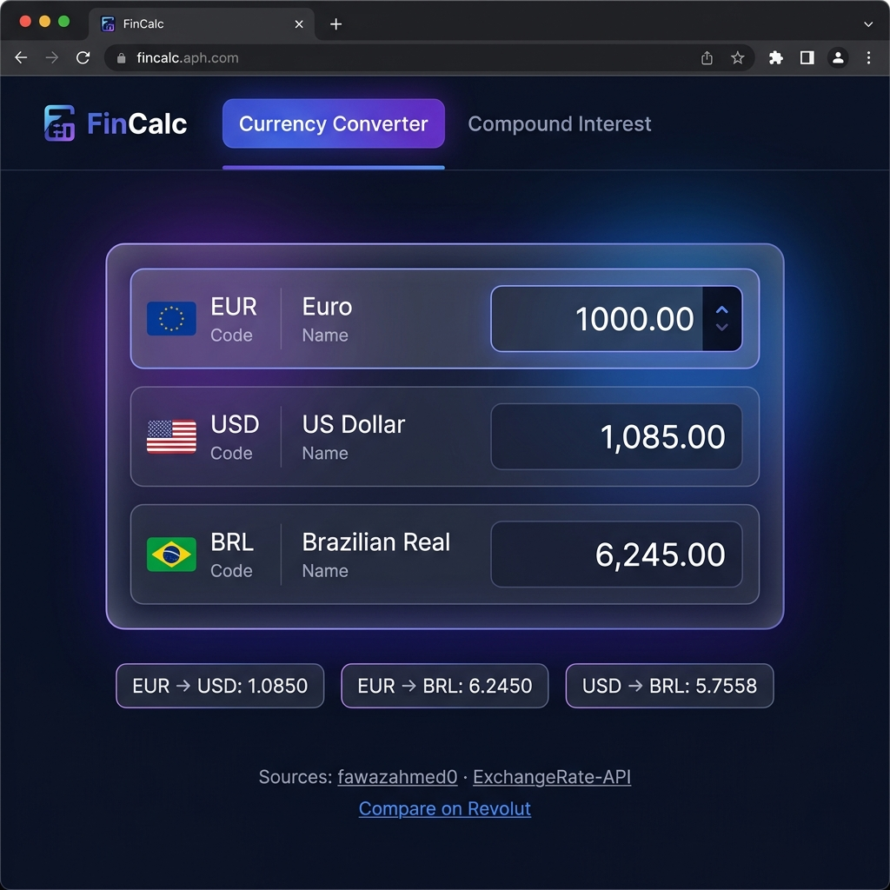
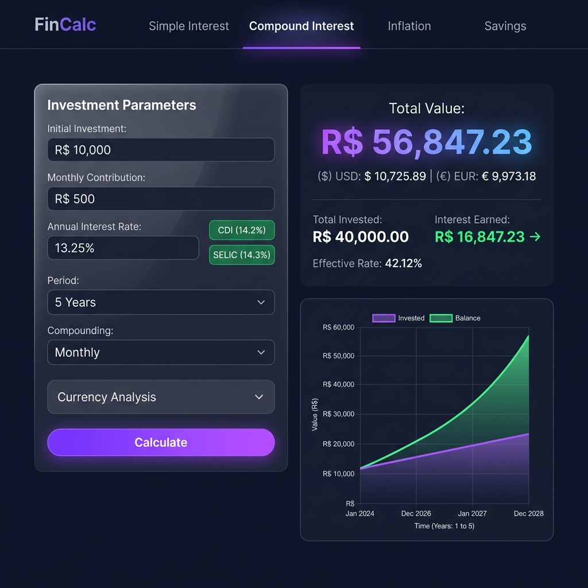
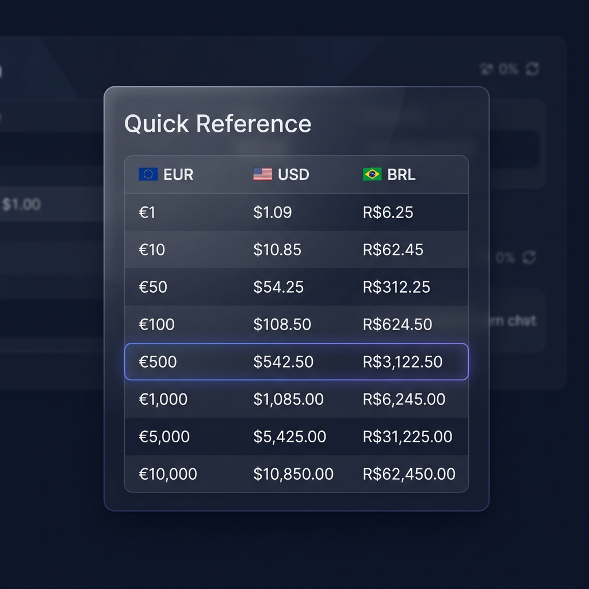

# FinCalc — Currency Converter & Compound Interest Calculator

A sleek, single-page personal finance tool for converting between **EUR**, **USD**, and **BRL** with live exchange rates, and calculating compound interest growth using real Brazilian benchmark rates (CDI & SELIC).

Built with vanilla HTML, CSS, and JavaScript — zero dependencies, no build step.

  

---

## Screenshots

### Currency Converter

Convert between EUR, USD, and BRL with live rates fetched from multiple sources.

<p align="center">
  
</p>

### Compound Interest Calculator

Calculate investment growth with Brazilian CDI/SELIC rates, complete with multi-currency projections and an interactive chart.

<p align="center">
  
</p>

### Quick Reference Table

Instant conversion lookup for common EUR amounts across all three currencies.

<p align="center">
  
</p>

---

## Features

### 💱 Currency Converter

- **Tri-directional conversion** — type in any currency (EUR, USD, or BRL) and the other two update instantly.
- **Live exchange rates** with automatic API fallback:
  - Primary: [fawazahmed0 Currency API](https://github.com/fawazahmed0/exchange-api)
  - Secondary: [ExchangeRate-API](https://www.exchangerate-api.com/)
- **1-hour rate caching** via `localStorage` to minimise API calls.
- **Quick Reference table** showing conversions for common EUR amounts (€1 – €10,000).
- Link to [Revolut's converter](https://www.revolut.com/currency-converter/) for cross-referencing.

### 📈 Compound Interest Calculator

- Configurable **initial investment**, **monthly contribution**, **annual rate**, **period**, and **compounding frequency** (daily → annually).
- **One-click CDI & SELIC presets** — rates are fetched live from the [Banco Central do Brasil (BCB) API](https://www.bcb.gov.br/) and annualised from daily values.
- **Currency Analysis** panel with two modes:
  - **Projection** — set expected annual BRL change against USD/EUR and see projected balances in foreign currencies.
  - **Historical** — fetches real month-by-month exchange rates and shows what your investment would have been worth in USD/EUR at each point in time.
- **Results summary** — Total Value, Total Invested, Interest Earned, and Effective Rate, all displayed in BRL, USD, and EUR.
- **Interactive line chart** (pure `<canvas>`, no charting library) plotting Invested vs Balance over time.
- **Monthly breakdown table** with per-period contributions, interest, and balances in all three currencies.

---

## Getting Started

### Prerequisites

A modern web browser — that's it. No Node.js, no package manager, no build tools required.

### Running Locally

1. **Clone the repository:**

   ```bash
   git clone <your-remote-url>
   cd converter
   ```

2. **Open in browser** — either:

   - Double-click `index.html` to open directly, or
   - Serve with any static file server:

     ```bash
     # Python
     python3 -m http.server 8000

     # Node.js (if available)
     npx serve .
     ```

3. **Navigate to** `http://localhost:8000` (if using a server).

> **Note:** The app fetches live data from external APIs, so an internet connection is required for the first load. Cached rates will work offline for up to 1 hour.

---

## Usage

### Converting Currencies

1. Open the app — the **Currency Converter** tab is active by default.
2. Type an amount into **any** of the three currency fields (EUR, USD, or BRL).
3. The other two fields update automatically with the converted amounts.
4. Current exchange rates are displayed below the converter, along with the data sources.
5. Scroll down to see the **Quick Reference** table for common EUR conversion amounts.

### Calculating Compound Interest

1. Click the **Compound Interest** tab in the header.
2. Enter your **Initial Investment** (in R$) and an optional **Monthly Contribution**.
3. Set the **Annual Interest Rate**, or click the **CDI** or **SELIC** buttons to auto-fill the current Brazilian benchmark rate.
4. Choose the **Period** (years or months) and **Compounding Frequency** (daily, monthly, quarterly, semi-annually, or annually).
5. *(Optional)* Expand the **Currency Analysis** section to:
   - **Projection mode** — set expected annual BRL depreciation/appreciation vs USD and EUR.
   - **Historical mode** — select a start date to use real historical exchange rates.
6. Click **Calculate** to see:
   - A results summary showing Total Value, Total Invested, Interest Earned, and Effective Rate — all with USD and EUR equivalents.
   - A line chart comparing your total contributions vs portfolio balance over time.
   - A detailed monthly breakdown table.

---

## Project Structure

```
converter/
├── index.html          # Page structure and layout
├── style.css           # Dark glassmorphism design system
├── app.js              # All application logic (API calls, calculations, chart)
├── screenshots/        # README screenshots
│   ├── currency-converter.png
│   ├── compound-interest.png
│   └── quick-reference.png
└── README.md           # This file
```

No frameworks, no bundlers, no transpilers — just three source files.

---

## Data Sources

| Data              | Source                                                                                     | Endpoint                          |
| ----------------- | ------------------------------------------------------------------------------------------ | --------------------------------- |
| Exchange rates    | [fawazahmed0 Currency API](https://github.com/fawazahmed0/exchange-api)                    | jsDelivr CDN                      |
| Exchange rates    | [ExchangeRate-API](https://www.exchangerate-api.com/)                                      | open.er-api.com                   |
| Historical rates  | [fawazahmed0 Currency API](https://github.com/fawazahmed0/exchange-api)                    | jsDelivr CDN (date-versioned)     |
| CDI rate          | [Banco Central do Brasil](https://www.bcb.gov.br/)                                        | SGS series 12                     |
| SELIC rate        | [Banco Central do Brasil](https://www.bcb.gov.br/)                                        | SGS series 11                     |

All rates are for **informational purposes only** and should not be used for financial transactions.

---

## How It Works

### Currency Converter

1. On page load, exchange rates are fetched from both APIs in parallel for all three base currencies.
2. Rates are cached in `localStorage` for 1 hour.
3. When you type in any currency input, the app converts to the other two using the best available rate (primary API preferred, secondary as fallback).

### Compound Interest Calculator

1. The calculator runs a **month-by-month simulation**, applying compound interest at the selected frequency.
2. When CDI or SELIC is selected, the daily rate from BCB is annualised using: `(1 + daily_rate)^252 - 1`.
3. **Projection mode** applies a constant annual FX drift to the spot rate.
4. **Historical mode** fetches real exchange rates for each month of the investment period and uses those for currency conversion.
5. The chart is rendered on a `<canvas>` element with device-pixel-ratio scaling for crisp rendering on Retina displays.

---

## License

This project is provided as-is for personal use.
